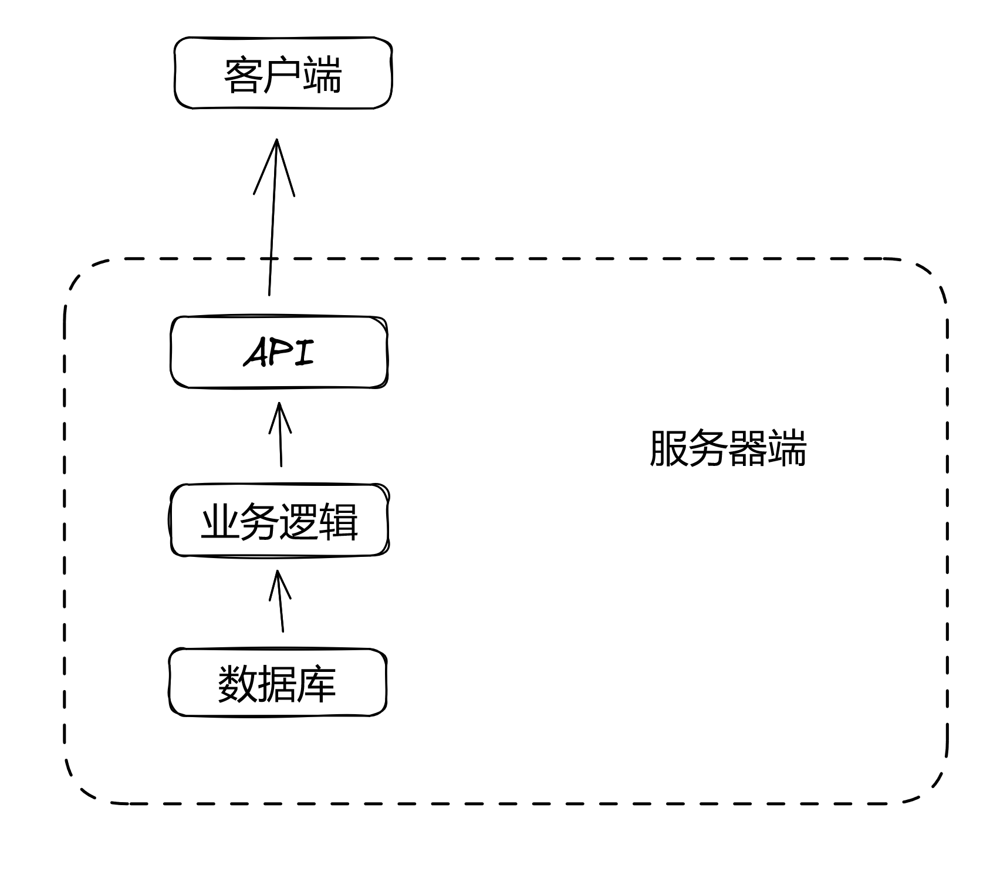
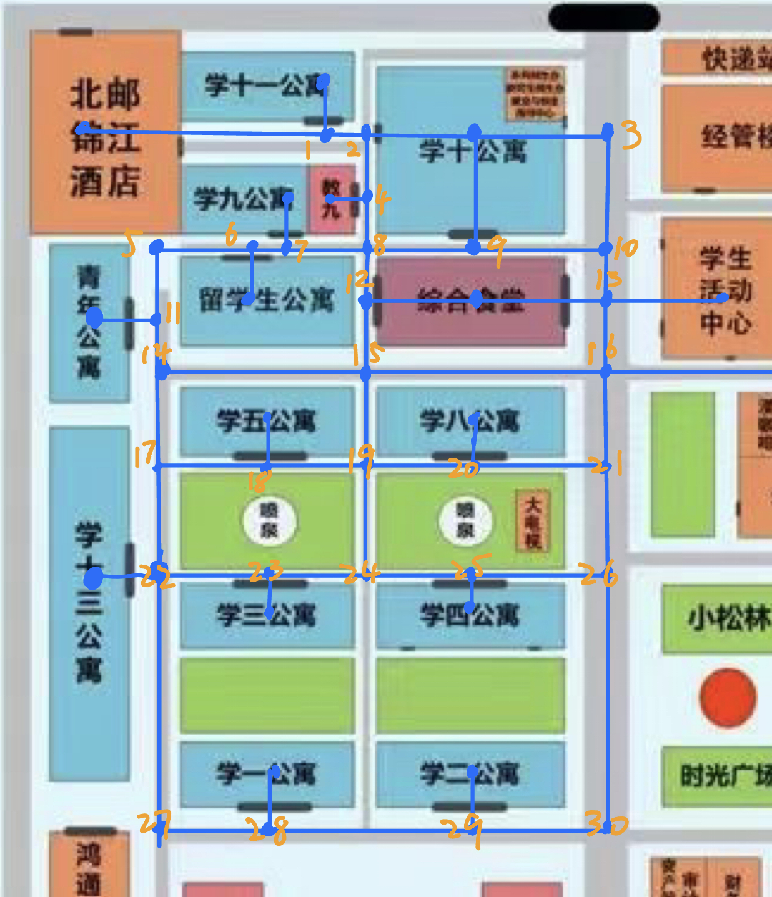

# 概要设计

> 小组成员：康京旸，张烨，麦麦提艾力·艾力

## 总体方案设计

系统设计为网页应用程序，用户端使用 JavaScript 的 React.js 框架搭建网页界面，服务器端使用 Java 的 SpringBoot 框架构建 API，其中业务逻辑的处理以及数据的存储等操作均在服务器端进行。

关于定时模块，现有两种方案：
1. 后端维护一个“信箱”，前端定时发送请求查询状态（通知内容）
2. 使用SSE(Server Sent Event)，后端主动向前端发送信息。

鉴于目前进度以及对于开发工具，平台，框架的熟悉情况，上面两种方案的选择待定。

## 开发环境

> 所用到的所有工具均跨平台（Windows, MacOS, Linux）
> 
- Git 版本控制
- [www.gitee.com](http://www.gitee.com) 托管仓库
- Postman 调试 API

### 客户端

- JavaScript 语言（node.js）
    - v20.0.0
    - v18.16.0
    - (不能保证在老版本的 node.js 上能正确运行)
- npm 包管理器
- React.js 框架
- Neovim, VScode 文本编辑器

### 服务器端

- Java 语言（OpenJDK 17）
- Gradle 自动化构建工具
- SpringBoot 框架
- Neovim 文本编辑器，IntelliJ IDEA IDE

## 总体结构

管理员拥有 3 个页面，分别是

- 课程管理页面：可以添加、删除课程
- 日志查询页面：可以按时间、按等级、按日期查询日志
- 学生管理页面：可以看到所有学生的列表、可以删除学生

学生拥有 3 个页面，分别是

- 主页
显示控制模拟时间开始、结束的控件，显示系统通知，显示地图。
- 日历页面
显示日程安排表
对于管理员用户而言，日程表中有用于添加、删除课程的控件。
对于学生用户而言，日程表中有添加课外活动的控件
所有用户的课程页面均有查询课程、显示课程的组件。
管理员可以看到所有的课程，学生只能看到自己参加的课程。
管理员不能看到学生安排的课外活动，学生可以看到自己参与的课外活动。
- 临时事物页面
显示临时事物列表和添加、删除临时事物的控件。

## 模块划分

### 客户端

上文提到的页面，每个页面一个模块。

#### 前端 React 项目目录结构

- frontend/
  - public/
    > 存放图片等静态资源
  - src/
    - components/
      - `NavBar.jsx`
      - `NavBar.css`
      - `ClassTable.jsx`
      - `ClassTable.css`
      > 页面中用到的组件
    - pages/
      - `StudentPage.jsx`
      - `StudentActivities.jsx`
      - `StudentCourse.jsx`
      - `StudentOthers.jsx`
      - `AdminPage.jsx`
      - `AdminActivities.jsx`
      - `AdminCourse.jsx`
      - `AdminOthers.jsx`
      - `LoginPage.jsx`
      > 上文概要设计中所提到的不同页面
    - `index.js`
    - `index.css`
  - `package.json`
    > npm 配置文件

### 服务器端



__API__

与客户端通信的模块，监听并处理来自前端的请求。

__业务逻辑__

被上层API模块调用，使用各种算法完成各种逻辑处理。

__数据库__

因要求，本项目不使用真正意义上的数据库，而是将数据以 json 格式储存在服务端的若干个文件中。
这里的数据库模块是指为方便使用，将文件的读写封装成的模块，供上层业务逻辑调用。

#### 后端 SpringBoot 项目目录结构
- schedule_system/
  - configurations/
    - `DataConfig.java`
    - ...
    > 每一个类中定义一些项目初始化时的@Bean
  - controllers/
    - `LoginController.java`
    - ...
    > 每一个类对应着一个提供给前端的API
  - utils/
    - `Course.java`
    - `ClassTime.java`
    - ...
    > 工具类
  - fakeDB/
    - `UserData.java`
    - ...
    > 每一个类对应着一个用于存储对应的数据的json文件，负责这个文件的读、写。
  - `App.java`

## 数据结构设计

### 线性表

> 使用泛型的线性表 KList

其内部使用数组存储数据，也可以当作队列、栈使用。
其 `toArray` 方法直接返回 `T[]`，方便使用。
其包含一个 `quickSort` 方法，可以传入一个 lambda 表达式。
lambda 表达式接受两个参数 a 和 b，如果 a 应该被排在 b 前面
就 retun true，否则 return false。
之所以没有设计成 java 中 Comparator 的 返回 1、0、-1 的形式，
是因为快排本身就是不稳定排序。

### 哈希表

> 使用泛型、可扩容的哈希表 KMap，其内部用以数组存储键值对

初始长度设置为 16，defaultFactor 设置为 0.75。

### 位图

> 使用 32 位 int 数组，数组每个元素拥有 32 位信息

可以设置值并对整个位图进行与、或、非、异或等操作。

### 时间

系统中有两类时间：课程时间和临时事物时间，其主要区别是开始时间和结束时间。
同时，想要使得重复事物和只有单次的事物能使用同样的数据结构，
故时间类不存储第几周，开始周和结束周存储在对应事物的类中，
只有单次的活动就让开始周和结束周相等。
因此做如下设计

定义抽象类 `SystemTime`，存储周几、几点、持续时间。

```java
int day;
int time;
int duration;
```

此外，为了方便与客户端通信、为了方便模拟模块的操作，
将一学期中每个时间点（每个小时）编一个唯一的索引（timeIndex）。
`SystemTime` 类提供了一些将真实时间和时间索引转换的函数。

```java
public final static int realTimeToIndex(int week, int day, int time)
```

同时，为了应对需求的改变（如一学期周数、每天课程类事物、
临时和课外活动类事物的开始、结束时间改变）将这些值作为
一组 `SystemTime` 类的静态方法，其他需要使用这些值的模块
通过调用方法获取该值。这样在更改需求时不需要在各个模块
分别修改。

`ClassTime` 和 `ActivityTime` 类继承 `SystemTime`，其参数
只在构造函数中规定不同的有效取值范围，无其他改动。

临时事物的时间比较特殊，不会重复且持续时间只有一个小时。
故将 `EventTime` 独立出来，包含以下参数

```java
private int week;
private int day;
private int time;
```

### 日程安排

每个学生的日程安排在 `Student` 类中存储，只存储对应课程、课外活动、临时事物的
名字。

```java
private String[] courses;
private String[] events;
private String[] activities;
private String name;
```

`StudentData` 类是存储并管理每个学生的日程安排的类。
最重要的两个参数是

```java
private KMap<String, Student> students; // 学生
private KMap<String, BitMap> schedules; // 学生日程安排的位图
```

这个类使用 Spring 的单例模式 bean，只在程序开始运行的时候创建一次，
创建时读取文本文件中的 Student 列表，
并构建出以学生名为 key 的学生类、学生时间安排位图的哈希表。
当这个类的添加、删除课程等方法被调用时，内存中哈希表内的信息
更新后将新信息写入文件，不会重复读取文件。
在响应请求时尽可能高效。

为了方便将学生添加、删除到特定课程，故将课程数据结构与学生数据结构解耦。
`Course` 类中存储以下信息

```java
private int startWeek;       // 课程开始周
private int endWeek;         // 课程结束周
private int testWeek;        // 课程考试周
private ClassTime classTime; // 每周的上课时间
private ClassTime examTime;  // 考试时间
private String name;         // 课程名称（唯一id）
private String location;     // 课程地点
```

`CourseData` 类维护一个以课程名为 key 存储 `Course` 的哈希表。
也是使用 Spring singleton bean，读写文件形式类似上面的 `StudentData`。

`ActivityData`、`EventData` 同理。

### 地图与导航


#### 1. 从地图上记录哪些信息

节点

记录信息是一个把地图数据转换成抽象的图数据结构的过程，我们把地图中的两种点作为图数据结构中的节点：

1. **楼**，作为任何路径的起点和终点
2. **路口**，为了便于处理，让图中所有的边都“横平竖直”，加入一些不能作为路径起点和终点的节点。但是这两种节点在最短路径算法中是不作区分的。

节点名称

> 要达到的目的：所有节点的名称不重复，是唯一的id
> 

对于**楼**节点，就按照地图上的名字来命名。

对于**路口**节点，统一按照标号命名。

---

如下图



节点坐标

我们通过定义地图左上角为$(0, 0)$，右下角为$(宽, 高)$来生成每个节点的坐标。记录下节点坐标，因为边都是“横平竖直”的，程序就可以通过相邻节点的坐标计算出他们之间路径的长度，即边权值。

邻接节点

为了把地图抽象成图数据结构，我们还需要记录每一个节点的邻接节点。因为节点的名称就是节点的唯一id，我们只需记录与每个节点相邻的节点名称即可。

#### 2. 记录信息的格式

采用Json文本格式，原因：应用广泛，在不同编程语言中都有相关的库可以直接拿来用，方便使用。格式如下：

```json
[
  {
    "location": {
      "name": "北邮锦江酒店",
      "x": 0,
      "y": 0
    },
    "isBuilding": true,
    "adj": [
        "1"
    ]
  },
  {
    "location": {
      "name": "1",
      "x": 1,
      "y": 0
    },
    "isBuilding": false,
    "adj": [
        "北邮锦江酒店",
        "学十一公寓"
    ]
  }
]
```

其中 location 记录节点名称和坐标，isBuilding 记录节点类型，adj 记录节点的邻接节点。

#### 3. 程序读取记录信息

在大作业中使用地图信息之前，我们需要在手动录入的信息的基础上计算出节点与其邻接节点之间的权值。上文的格式只是为了方便手工录入，并不适合直接用来作为程序的配置文件。

#### 4. 分工

前期准备

需要规定一个统一的图片，用于分工进行数据的录入（节点坐标等信息）。**注意**：这个规定好的图片一定不能通过微信等方式直接传输，一定要打包成压缩包，传输后解压，防止图片的尺寸被压缩导致像素录入错误。

预处理：在规定好的这个图片上进行标注，把每个路口标好一个不重复的编号。

分工

将地图划分为几块分别给几个人负责，每个人分别作出一个 .json 文件，再汇总到一起。


共有75个建筑，116个节点，分为下面几组

1. 上图橙色线上面的黄点
2. 橙色线下面的黄点
3. 白点 1 - 35
4. 白点 36 - 70
5. 白点 71 - 116（下面白点好做）

白点（isBuilding = false）的 location 的 name 就是编号（字符串形式，如："114"）

黄点（isBuilding = true）的 location 的 name 就是地图上的名字

完成手工录入信息后，通过一个程序计算出每个节点的邻接表中的权值，在主项目中直接读取，无需计算。

